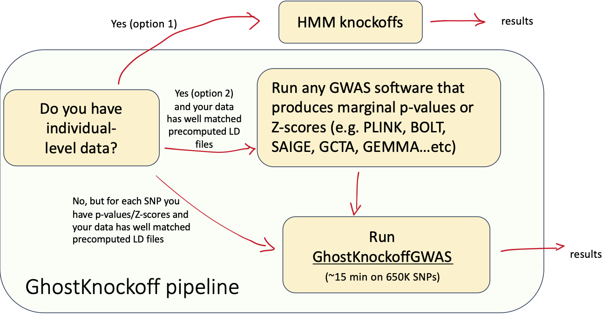

# GWAS summary statistics analysis via Knockoff-filter

This is package for performing knockoff-based analysis of GWAS summary statistics. The knockoff-filter finds conditionally independent discoveries while controlling the FDR (false discovery rate) to any specified level. 

!!! warning

    The Julia package supports Linux and macOS on Julia 1.10 and 1.12 when a matching `Ghostbasil.jl`/`ghostbasil_jll` artifact is installed. Windows is not supported. Julia 1.11 is not currently supported by the published `ghostbasil_jll` artifacts. Prebuilt app downloads may cover fewer platforms than the Julia package; see the downloads page for currently published bundles.
