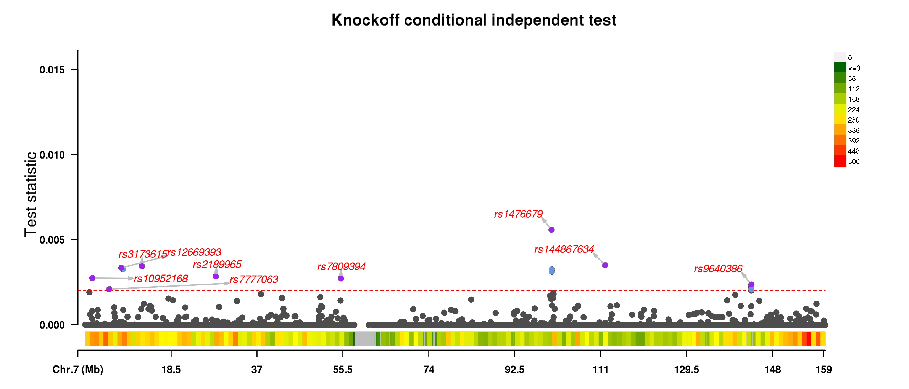

# Detailed Example

This page collect examples of running the ghost knockoff pipeline. We will cover topics such as installation, examining input data, running the software, and interpreting the output. 

## Quick Start

Here is a short summary of this tutorial:

1. Step 1: Download pre-processed LD files and binary executable and extract their content

        wget https://github.com/biona001/GhostKnockoffGWAS/releases/download/v0.2.1/app_linux_x86.tar.gz
        wget https://zenodo.org/records/10433663/files/EUR.zip
        tar -xvzf app_linux_x86.tar.gz
        unzip EUR.zip  # decompresses to ~8.7GB
2. Step 2: Prepare a valid Z score file, or download an example as:

        wget https://github.com/biona001/GhostKnockoffGWAS/raw/main/data/example_zfile.txt
3. Step 3: Run the analysis

        app_linux_x86/bin/GhostKnockoffGWAS --zfile example_zfile.txt --LD-files EUR --N 506200 --genome-build 38 --out example_output
        
4. (optional): Make Manhattan plot with [this R script](https://github.com/biona001/GhostKnockoffGWAS/blob/main/src/manhattan.R). 

## Step 1: Download pre-processed LD files and binary executable

Proceed to the [Downloads page](https://biona001.github.io/GhostKnockoffGWAS/dev/man/download) and download (1) the software as well as (2) a pre-processed knockoff dataset suitable for your analysis, e.g.
```shell
wget https://github.com/biona001/GhostKnockoffGWAS/releases/download/v0.2.1/app_linux_x86.tar.gz
wget https://zenodo.org/records/10433663/files/EUR.zip
```
Next, unzip the files in linux command line via:
```shell
tar -xvzf app_linux_x86.tar.gz
unzip EUR.zip # decompresses to ~8.7GB
```
This should create 2 folders `app_linux_x86/` and `EUR/` in the current directory. The executable is located inside `app_linux_x86/bin/GhostKnockoffGWAS`. We recommend adding the folder containing the `GhostKnockoffGWAS` executable to `PATH` for easier access.

!!! warning

    Do NOT modify the contents in unzipped folders! 

## Step 2: Prepare a valid Z score file

One needs a [valid Z score file](https://biona001.github.io/GhostKnockoffGWAS/dev/man/zfile) as input. 

If you would like to follow along with this tutorial, feel free to download this test data [example_zfile.txt](https://github.com/biona001/GhostKnockoffGWAS/blob/main/data/example_zfile.txt) (17MB). The first few rows is
```
CHR	POS	REF	ALT	Z
7	27916	T	C	1.82946485242
7	30580	C	T	0.877343668618
7	30581	A	T	0.876791309991
7	31273	G	C	-0.567289962351949
7	31439	T	A	-0.907002943915131
7	31627	A	C	0.577058407641
7	32858	C	T	1.80586134742
7	33482	T	G	0.47877317796
7	34215	T	C	-0.711135940901
```
+ The first row is a header row which includes `CHR`, `POS`, `REF`, `ALT`, `Z`. Other columns will be ignored. 
+ Each row is a different SNP and each column is separated by a tab (i.e. `\t` character) or a comma

In this example

+ The `POS` field corresponds to hg38 positions. GhostKnockoffGWAS requires the position to be either hg19 or hg38.
+ The sample size used for generating this data is `506200`. Thus one should specify `--N 506200`.

## Step 3: Running the analysis

To see a list of available arguments, execute `GhostKnockoffGWAS --help`. 

To run the example analysis, run the following in the terminal

```shell
GhostKnockoffGWAS --zfile example_zfile.txt --LD-files EUR --N 506200 --genome-build 38 --out example_output
```

Here is the expected output:
```
Welcome to GhostKnockoffGWAS analysis!
You have specified the following options:
zfile           = /oak/stanford/groups/zihuai/pan_ukb_group_knockoffs/example_zfile.txt
LD_files        = /oak/stanford/groups/zihuai/pan_ukb_group_knockoffs/EUR
N (sample size) = 506200
hg_build        = 38
outdir          = /oak/stanford/groups/zihuai/pan_ukb_group_knockoffs/
outfile         = /oak/stanford/groups/zihuai/pan_ukb_group_knockoffs/example_output
seed            = 2023
verbose         = true
random_shuffle  = false
skip_shrinkage_check = false

count_matchable_snps processed chr 7, cumulative SNPs = 35855
region 1 / 99 (f = LD_start100196651_end101199252.h5): chr 7, nz beta = 10, nsnps = 306, shrinkage = 0.1909
region 2 / 99 (f = LD_start101199253_end103197509.h5): chr 7, nz beta = 13, nsnps = 332, shrinkage = 0.0346
region 3 / 99 (f = LD_start103197510_end104159524.h5): chr 7, nz beta = 12, nsnps = 215, shrinkage = 0.0458
region 4 / 99 (f = LD_start104159525_end105682904.h5): chr 7, nz beta = 10, nsnps = 358, shrinkage = 0.0012
region 5 / 99 (f = LD_start105682905_end107780177.h5): chr 7, nz beta = 19, nsnps = 532, shrinkage = 0.0034
...<some output truncated>

Matched 35855 SNPs with Z-scores to the reference panel
Mean LD shrinkage = 0.020501422972314207.
Done! Result saved to /oak/stanford/groups/zihuai/pan_ukb_group_knockoffs/example_output. 
Overall runtime = 59.10963104499999 seconds, with 
   2.67976535 seconds spent on reading the Z score file
   56.429865695 seconds spent on doing the analysis
```

**Explanation for intermediate outputs**:

+ `GhostKnockoffGWAS` first prints the user-specified parameters in the analysis. Verify that they are correct.
+ Next we print the output of `count_matchable_snps`. It is essentially matching user supplied Z scores to the pre-computed knockoff data and counting how many SNPs can be matched. This information will be used to quantify the level shrinkage in Lasso regression. 
+ Then for each region, it will try to analyze the genome in quasi-independent regions, e.g. 
```
region 1 / 99 (f = LD_start100196651_end101199252.h5): chr 7, nz beta = 10, nsnps = 306, shrinkage = 0.1909
region 2 / 99 (f = LD_start101199253_end103197509.h5): chr 7, nz beta = 13, nsnps = 332, shrinkage = 0.0346
region 3 / 99 (f = LD_start103197510_end104159524.h5): chr 7, nz beta = 12, nsnps = 215, shrinkage = 0.0458
...
```
+ Here there are 99 regions in chromosome 7. For each region it prints the number of non-zero beta estimated in that region, the number of Z-scores that are present in that region, and finally the level of shrinkage. The shrinkage level is a number between 0 and 1. It quantifies how well the correlation matrices used in the analysis approximates the LD structure for the original GWAS study under the null ($z = 0$), see [SuSiE paper](https://journals.plos.org/plosgenetics/article?id=10.1371/journal.pgen.1010299) equation 24 for details.
+ Finally, the program concludes by printing the number of Z scores successfully matched, the output path, as well as a rough estimate of runtime. In this simple example, the analysis finished in roughly a minute. 

## Step 4: Interpreting the result

If you are following along, `GhostKnockoffGWAS` should have produced 2 outputs
1. `example_output_summary.txt`
2. `example_output.txt`

### `example_output_summary.txt` 

This file contains broad summary of the analysis, as shown below

```
target_fdr_0.01_num_selected,0
target_fdr_0.05_num_selected,8
target_fdr_0.1_num_selected,15
target_fdr_0.2_num_selected,24
m,5
nregions,99
nsnps,35855
lasso_lambda,0.003807185801078654
mean_LD_shrinkage,0.02050142301854868
import_time,20.175387030000003
sample_knockoff_time,11.177338719
ghostbasil_time,0.8567632319999999
knockoff_filter_time,8.442171458
total_time,41.34364295005798
sample_knockoff_time_t21,3.9536202269999987
sample_knockoff_time_t22,2.155882097
sample_knockoff_time_t23,1.0207068969999997
sample_knockoff_time_t24,3.2455576749999993
```

+ The first 4 rows indicate the number of discovered SNPs according to `GhostKnockoffGWAS`, for different target FDR levels. For example, when target $\text{FDR} = 0.1$, there are 15 significant SNPs whose knockoff q-value is below 0.1. If these SNPs reside in different groups, then according to the knockoff procedure, these discoveries are conditionally independent. Later in step 5, we will apply a post-processing step to further count the number of independent discoveries as determined by the physical distance between these SNPs. 
+ The next few rows contain parameters used in the analysis, as well as timing results. 

!!! tip
    
    One should always check the value of `mean_LD_shrinkage`, here it is $0.02050$. As discussed above, this value quantifies how well the correlation matrices used in the analysis approximates the LD structure for the original GWAS study. A value close to 0 is good, while larger values indicate deviation. `GhostKnokcoffGWAS` automatically terminates when this value exceeds a certain threshold.

### `example_output.txt`

This is a comma-separated file that contains the full knockoff analysis output. The first 5 rows are shown:
```
$ head -5 example_output.txt
rsid,AF,chr,ref,alt,pos_hg38,group,zscores,lasso_beta,kappa,tau,W,qvals,pvals,selected_fdr0.01,selected_fdr0.05,selected_fdr0.1,selected_fdr0.2
rs4535687,0.15927,7,G,C,41892,chr7_start16161_end972751_group1_0,-1.17940334810126,0.0,0,0.0,0.0,1.0,0.23823760256835697,0,0,0,0
rs62429406,0.031058,7,T,G,43748,chr7_start16161_end972751_group2_0,0.636126444862832,0.0,0,0.0,0.0,1.0,0.5246940103826294,0,0,0,0
rs117163387,0.034958,7,C,T,43961,chr7_start16161_end972751_group3_0,-0.548757491205702,0.0,0,0.0,0.0,1.0,0.5831718861307663,0,0,0,0
rs4247525,0.040199,7,T,C,44167,chr7_start16161_end972751_group4_0,0.463442453535633,0.0,0,0.0,0.0,1.0,0.6430472544316368,0,0,0,0
```

The first row is a header row. Each proceeding row corresponds to a SNP that was used in the analysis. 

+ `rsid,AF,chr,ref,alt,pos_hg38` is the SNP ID, alternate allele frequency, reference allele, alternate allele, basepair position in HG38 coordinates.
+ `group` column: defines group membership. 
+ `zscores`: This is the user-provided Z-scores.
+ `lasso_beta`: This is the Lasso's estimated effect size for each SNP conditional on the knockoffs. 
+ `kappa,tau,W`: these are knockoff statistics computed from the analysis, please refer to our paper for more detail. 
+ `qvals`: This is the knockoff q-values, which is the minimum target FDR for a given variable to be selected, i.e. for a target FDR level $\alpha$, all variants with `qvals` $\le \alpha$ is selected. 
+ `pvals`: This is the p-value obtained by back-transforming the input Z-scores
+ `selected_fdrα` columns: these inform whether the variable is selected when target FDR is $\alpha$. 

!!! note

    Sometimes it is useful to determine the number of *conditionally independent* discoveries according to the knockoff procedure. In this case, one should count the number of unique *groups* that contains the discovered SNPs. In this example, when target FDR is $10\%$, there are 15 SNPs with knockoff q-values less than 0.1, and they reside in 11 unique groups. Thus, the knockoff procedure claims there are at least 11 unique (conditionally-independent) causal variables. 

## Step 5: Generating Manhattan plots

We can generate Manhattan plots by running [this R script](https://github.com/biona001/GhostKnockoffGWAS/blob/main/src/manhattan.R) in the terminal (this requires the `R` packages `data.table`, `plyr`, `dplyr`, `CMplot`). Usage:

```R
$ Rscript --vanilla manhattan.R arg1 arg2 arg3 arg4
```
+ `arg1`: Main output file from GhostKnockoffGWAS
+ `arg2`: Where output Manhattan plots should be stored (a `.` indicates store in current directory)
+ `arg3`: Output filename (without extensions) to be used for both plots, e.g. phenotype name
+ `arg4`: Target FDR in percentage

For example, 

```R
$ Rscript --vanilla manhattan.R example_output.txt . example_plot 0.1
```

This produced the following plots




### Explanation:

+ The knockoff plot displays the knockoff W values on the y-axis, one dot for each SNP. The most significant SNP within a 1Mb region is labeled and colored with purple. Light blue dots are knockoff discoveries that are within 1Mb distance to another more significant SNP. Careful readers may recall that in the summary file (shown in step 4), `GhostKnockoffGWAS` discovered 15 SNPs which falls within 11 unique *groups*, but here only 9 SNPs were labelled. This is because some discoveries are too close to each other. In this example, only 9 among 15 SNPs are physically greater than 1Mb apart. This immediate begs the question of how many discoveries one should report. Our papers typically report the number of discoveries physically >1Mb apart (i.e. 9 discoveries in this case), but please note that there are in fact at least 11 conditionally independent discoveries according to the knockoff methodology.
+ The marginal plot is a standard Manhattan plot with the y-axis plotting the negative logged p-values. Similar to the knockoff plot, all dots above the dotted line are marginally significant and colored with light blue, while the most signicant SNP within 1Mb region is colored with purple. 
+ The color bars beneath the x-axis displays chromosome density.
