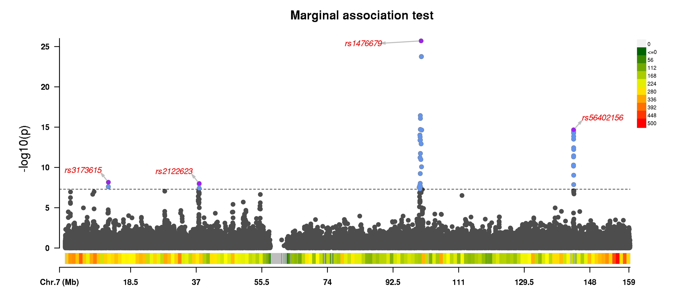

# Detailed Example

This page collect examples of running the ghost knockoff pipeline. We will cover topics such as installation, examining input data, running the software, and interpreting the output. 

## Step 1: Download pre-processed LD files and binary executable

Proceed to the [Downloads page](https://biona001.github.io/GhostKnockoffGWAS/dev/man/download) and download (1) the software as well as (2) a pre-processed knockoff dataset suitable for your analysis. 

After downloading the software, e.g. `app_linux_x86.tar.gz`, unzip the file in linux command line via:
```shell
tar -xvzf app_linux_x86.tar.gz
```
This should create a folder called `app_linux_x86` in the current directory. The executable is located inside `app_linux_x86/bin/GhostKnockoffGWAS`. We recommend adding the folder containing the `GhostKnockoffGWAS` executable to `PATH` for easier access.

!!! warning

    Do NOT modify the content in unzipped folder. 

## Step 2: Prepare a valid Z score file

One needs a [valid Z score file](https://biona001.github.io/GhostKnockoffGWAS/dev/man/getting_started/#Acceptable-Z-scores-file-format) as input. 

If you would like to follow along with this tutorial, feel free to download this test data [example_zfile.txt](https://github.com/biona001/GhostKnockoffGWAS/blob/main/data/example_zfile.txt) (17MB). The first few rows is
```
CHR	POS	REF	ALT	Z
7	27916	T	C	1.82946485242
7	30580	C	T	0.877343668618
7	30581	A	T	0.876791309991
7	31273	G	C	-0.567289962351949
7	31439	T	A	-0.907002943915131
7	31627	A	C	0.577058407641
7	32858	C	T	1.80586134742
7	33482	T	G	0.47877317796
7	34215	T	C	-0.711135940901
```
+ The first row is a header row which includes `CHR`, `POS`, `REF`, `ALT`, `Z`. Other columns will be ignored. 
+ Each row is a different SNP and each column is separated by a tab (i.e. `\t` character) or a comma

In this example

+ The `POS` field corresponds to hg38 positions. GhostKnockoffGWAS requires the position to be either hg19 or hg38.
+ The sample size used for generating this data is `506200`. Thus one should specify `--N 506200`.

## Step 3: Running the analysis

To see a list of available arguments, execute `GhostKnockoffGWAS --help`. 

To run the example analysis, run the following in the terminal

```shell
GhostKnockoffGWAS --zfile example_zfile.txt --LD-files EUR --N 506200 --genome-build 38 --out example_output
```

Here is the expected output:
```
Welcome to GhostKnockoffGWAS analysis!
You have specified the following options:
zfile           = /scratch/users/bbchu/GhostKnockoffGWAS/data/example_zfile.txt
LD_files        = /scratch/users/bbchu/GhostKnockoffGWAS/data/EUR
N (sample size) = 506200
hg_build        = 38
outdir          = /scratch/users/bbchu/GhostKnockoffGWAS/data/
outfile         = /scratch/users/bbchu/GhostKnockoffGWAS/data/example_output
seed            = 2023
verbose         = true
random_shuffle  = true
skip_shrinkage_check = false

count_matchable_snps processed chr 7, cumulative SNPs = 35855
region 1 / 99 (f = LD_start100196651_end101199252.h5): chr 7, nz beta = 9, nsnps = 306, shrinkage = 0.1909
region 2 / 99 (f = LD_start101199253_end103197509.h5): chr 7, nz beta = 11, nsnps = 332, shrinkage = 0.0346
region 3 / 99 (f = LD_start103197510_end104159524.h5): chr 7, nz beta = 12, nsnps = 215, shrinkage = 0.0458
region 4 / 99 (f = LD_start104159525_end105682904.h5): chr 7, nz beta = 10, nsnps = 358, shrinkage = 0.0012
region 5 / 99 (f = LD_start105682905_end107780177.h5): chr 7, nz beta = 18, nsnps = 532, shrinkage = 0.0034
region 6 / 99 (f = LD_start107780178_end109647593.h5): chr 7, nz beta = 6, nsnps = 364, shrinkage = 0.0041
region 7 / 99 (f = LD_start109647594_end112618683.h5): chr 7, nz beta = 20, nsnps = 568, shrinkage = 0.0064
region 8 / 99 (f = LD_start112618684_end113712386.h5): chr 7, nz beta = 8, nsnps = 177, shrinkage = 0.0151
region 9 / 99 (f = LD_start11299198_end12635460.h5): chr 7, nz beta = 12, nsnps = 368, shrinkage = 0.0452
region 10 / 99 (f = LD_start113712387_end116780177.h5): chr 7, nz beta = 13, nsnps = 502, shrinkage = 0.0196
region 11 / 99 (f = LD_start116780178_end118351580.h5): chr 7, nz beta = 6, nsnps = 241, shrinkage = 0.0148
region 12 / 99 (f = LD_start118351581_end121045272.h5): chr 7, nz beta = 5, nsnps = 349, shrinkage = 0.0064
region 13 / 99 (f = LD_start121045273_end121933629.h5): chr 7, nz beta = 6, nsnps = 188, shrinkage = 0.0072
region 14 / 99 (f = LD_start121933630_end124156804.h5): chr 7, nz beta = 10, nsnps = 418, shrinkage = 0.0288
region 15 / 99 (f = LD_start124156805_end124167551.h5): chr 7, nz beta = 0, nsnps = 2, shrinkage = 0.0
region 16 / 99 (f = LD_start124167552_end126519169.h5): chr 7, nz beta = 5, nsnps = 386, shrinkage = 0.0022
region 17 / 99 (f = LD_start12635461_end13884201.h5): chr 7, nz beta = 8, nsnps = 371, shrinkage = 0.011
region 18 / 99 (f = LD_start126519170_end126869220.h5): chr 7, nz beta = 3, nsnps = 58, shrinkage = 0.0
region 19 / 99 (f = LD_start126869221_end128778385.h5): chr 7, nz beta = 11, nsnps = 402, shrinkage = 0.0182
region 20 / 99 (f = LD_start128778386_end130422413.h5): chr 7, nz beta = 8, nsnps = 356, shrinkage = 0.0075
region 21 / 99 (f = LD_start130422414_end132805847.h5): chr 7, nz beta = 24, nsnps = 668, shrinkage = 0.0106
region 22 / 99 (f = LD_start132805848_end134307595.h5): chr 7, nz beta = 5, nsnps = 241, shrinkage = 0.0012
region 23 / 99 (f = LD_start134307596_end135591082.h5): chr 7, nz beta = 8, nsnps = 281, shrinkage = 0.0185
region 24 / 99 (f = LD_start1353067_end2062397.h5): chr 7, nz beta = 9, nsnps = 224, shrinkage = 0.0553
region 25 / 99 (f = LD_start135591083_end136876561.h5): chr 7, nz beta = 9, nsnps = 268, shrinkage = 0.0089
region 26 / 99 (f = LD_start136876562_end138744678.h5): chr 7, nz beta = 32, nsnps = 577, shrinkage = 0.0085
region 27 / 99 (f = LD_start138744679_end139933176.h5): chr 7, nz beta = 11, nsnps = 302, shrinkage = 0.0162
region 28 / 99 (f = LD_start13884202_end15143656.h5): chr 7, nz beta = 7, nsnps = 418, shrinkage = 0.0097
region 29 / 99 (f = LD_start139933177_end140235209.h5): chr 7, nz beta = 1, nsnps = 105, shrinkage = 0.0
region 30 / 99 (f = LD_start140235210_end141226556.h5): chr 7, nz beta = 6, nsnps = 200, shrinkage = 0.0011
region 31 / 99 (f = LD_start141226557_end142656309.h5): chr 7, nz beta = 12, nsnps = 309, shrinkage = 0.0055
region 32 / 99 (f = LD_start142656310_end144968288.h5): chr 7, nz beta = 20, nsnps = 469, shrinkage = 0.0392
region 33 / 99 (f = LD_start144968289_end146427959.h5): chr 7, nz beta = 5, nsnps = 255, shrinkage = 0.0309
region 34 / 99 (f = LD_start146427960_end147815317.h5): chr 7, nz beta = 11, nsnps = 368, shrinkage = 0.0133
region 35 / 99 (f = LD_start147815318_end149840657.h5): chr 7, nz beta = 27, nsnps = 624, shrinkage = 0.0114
region 36 / 99 (f = LD_start149840658_end150711504.h5): chr 7, nz beta = 5, nsnps = 230, shrinkage = 0.0155
region 37 / 99 (f = LD_start150711505_end152249805.h5): chr 7, nz beta = 6, nsnps = 500, shrinkage = 0.0344
region 38 / 99 (f = LD_start15143657_end16902068.h5): chr 7, nz beta = 13, nsnps = 455, shrinkage = 0.0003
region 39 / 99 (f = LD_start152249806_end153674018.h5): chr 7, nz beta = 26, nsnps = 496, shrinkage = 0.0175
region 40 / 99 (f = LD_start153674019_end154964729.h5): chr 7, nz beta = 14, nsnps = 455, shrinkage = 0.0171
region 41 / 99 (f = LD_start154964730_end156065249.h5): chr 7, nz beta = 10, nsnps = 565, shrinkage = 0.0227
region 42 / 99 (f = LD_start156065250_end157634596.h5): chr 7, nz beta = 12, nsnps = 491, shrinkage = 0.0368
region 43 / 99 (f = LD_start157634597_end159128574.h5): chr 7, nz beta = 9, nsnps = 504, shrinkage = 0.0074
region 44 / 99 (f = LD_start16161_end972751.h5): chr 7, nz beta = 6, nsnps = 279, shrinkage = 0.0801
region 45 / 99 (f = LD_start16902069_end19481546.h5): chr 7, nz beta = 21, nsnps = 672, shrinkage = 0.0059
region 46 / 99 (f = LD_start19481547_end20124907.h5): chr 7, nz beta = 6, nsnps = 172, shrinkage = 0.0113
region 47 / 99 (f = LD_start20124908_end22507628.h5): chr 7, nz beta = 21, nsnps = 764, shrinkage = 0.0116
region 48 / 99 (f = LD_start2062398_end2772226.h5): chr 7, nz beta = 21, nsnps = 255, shrinkage = 0.0029
region 49 / 99 (f = LD_start22507629_end23471441.h5): chr 7, nz beta = 7, nsnps = 239, shrinkage = 0.0151
region 50 / 99 (f = LD_start23471442_end25077258.h5): chr 7, nz beta = 11, nsnps = 351, shrinkage = 0.0581
region 51 / 99 (f = LD_start25077259_end25909554.h5): chr 7, nz beta = 3, nsnps = 244, shrinkage = 0.0044
region 52 / 99 (f = LD_start25909555_end28360308.h5): chr 7, nz beta = 19, nsnps = 563, shrinkage = 0.0048
region 53 / 99 (f = LD_start2772227_end4573427.h5): chr 7, nz beta = 42, nsnps = 650, shrinkage = 0.3149
region 54 / 99 (f = LD_start28360309_end31137288.h5): chr 7, nz beta = 35, nsnps = 867, shrinkage = 0.0075
region 55 / 99 (f = LD_start31137289_end33555767.h5): chr 7, nz beta = 13, nsnps = 674, shrinkage = 0.0165
region 56 / 99 (f = LD_start33555768_end36213537.h5): chr 7, nz beta = 12, nsnps = 612, shrinkage = 0.0318
region 57 / 99 (f = LD_start36213538_end37555183.h5): chr 7, nz beta = 19, nsnps = 423, shrinkage = 0.0338
region 58 / 99 (f = LD_start37555184_end38966702.h5): chr 7, nz beta = 29, nsnps = 379, shrinkage = 0.0034
region 59 / 99 (f = LD_start38966703_end39862669.h5): chr 7, nz beta = 9, nsnps = 162, shrinkage = 0.0109
region 60 / 99 (f = LD_start39862670_end42001810.h5): chr 7, nz beta = 14, nsnps = 459, shrinkage = 0.0066
region 61 / 99 (f = LD_start42001811_end43159073.h5): chr 7, nz beta = 13, nsnps = 311, shrinkage = 0.0126
region 62 / 99 (f = LD_start43159074_end44763827.h5): chr 7, nz beta = 5, nsnps = 349, shrinkage = 0.0027
region 63 / 99 (f = LD_start44763828_end45952921.h5): chr 7, nz beta = 7, nsnps = 283, shrinkage = 0.0058
region 64 / 99 (f = LD_start4573428_end5416231.h5): chr 7, nz beta = 8, nsnps = 279, shrinkage = 0.004
region 65 / 99 (f = LD_start45952922_end46986719.h5): chr 7, nz beta = 5, nsnps = 245, shrinkage = 0.0002
region 66 / 99 (f = LD_start46986720_end49212277.h5): chr 7, nz beta = 13, nsnps = 593, shrinkage = 0.0087
region 67 / 99 (f = LD_start49212278_end51675321.h5): chr 7, nz beta = 28, nsnps = 554, shrinkage = 0.0071
region 68 / 99 (f = LD_start51675322_end53176311.h5): chr 7, nz beta = 9, nsnps = 355, shrinkage = 0.0075
region 69 / 99 (f = LD_start53176312_end54222975.h5): chr 7, nz beta = 12, nsnps = 180, shrinkage = 0.0045
region 70 / 99 (f = LD_start5416232_end5854525.h5): chr 7, nz beta = 6, nsnps = 145, shrinkage = 0.01
region 71 / 99 (f = LD_start54222976_end55691583.h5): chr 7, nz beta = 19, nsnps = 307, shrinkage = 0.0041
region 72 / 99 (f = LD_start55691584_end57382637.h5): chr 7, nz beta = 5, nsnps = 227, shrinkage = 0.0082
region 73 / 99 (f = LD_start57382638_end63307358.h5): chr 7, nz beta = 1, nsnps = 157, shrinkage = 0.0383
region 74 / 99 (f = LD_start5854526_end6573856.h5): chr 7, nz beta = 11, nsnps = 190, shrinkage = 0.0735
region 75 / 99 (f = LD_start63307359_end63641124.h5): chr 7, nz beta = 0, nsnps = 60, shrinkage = 0.0
region 76 / 99 (f = LD_start63641125_end65689808.h5): chr 7, nz beta = 5, nsnps = 273, shrinkage = 0.0341
region 77 / 99 (f = LD_start65689809_end68234073.h5): chr 7, nz beta = 23, nsnps = 527, shrinkage = 0.0288
region 78 / 99 (f = LD_start6573857_end7808751.h5): chr 7, nz beta = 6, nsnps = 303, shrinkage = 0.0201
region 79 / 99 (f = LD_start68234074_end69085363.h5): chr 7, nz beta = 6, nsnps = 221, shrinkage = 0.0187
region 80 / 99 (f = LD_start69085364_end71874884.h5): chr 7, nz beta = 8, nsnps = 557, shrinkage = 0.014
region 81 / 99 (f = LD_start71874885_end73334601.h5): chr 7, nz beta = 3, nsnps = 207, shrinkage = 0.0075
region 82 / 99 (f = LD_start73334602_end76458563.h5): chr 7, nz beta = 17, nsnps = 419, shrinkage = 0.0873
region 83 / 99 (f = LD_start76458564_end78093858.h5): chr 7, nz beta = 9, nsnps = 363, shrinkage = 0.0242
region 84 / 99 (f = LD_start7808752_end9123422.h5): chr 7, nz beta = 18, nsnps = 549, shrinkage = 0.0311
region 85 / 99 (f = LD_start78093859_end79888068.h5): chr 7, nz beta = 14, nsnps = 416, shrinkage = 0.0148
region 86 / 99 (f = LD_start79888069_end82022685.h5): chr 7, nz beta = 14, nsnps = 523, shrinkage = 0.0036
region 87 / 99 (f = LD_start82022686_end83801202.h5): chr 7, nz beta = 10, nsnps = 393, shrinkage = 0.0014
region 88 / 99 (f = LD_start83801203_end85572181.h5): chr 7, nz beta = 1, nsnps = 252, shrinkage = 0.0044
region 89 / 99 (f = LD_start85572182_end87825003.h5): chr 7, nz beta = 5, nsnps = 342, shrinkage = 0.0097
region 90 / 99 (f = LD_start87825004_end90661783.h5): chr 7, nz beta = 5, nsnps = 517, shrinkage = 0.0056
region 91 / 99 (f = LD_start90661784_end92493751.h5): chr 7, nz beta = 6, nsnps = 310, shrinkage = 0.0041
region 92 / 99 (f = LD_start9123423_end9987498.h5): chr 7, nz beta = 6, nsnps = 237, shrinkage = 0.0062
region 93 / 99 (f = LD_start92493752_end93966600.h5): chr 7, nz beta = 13, nsnps = 350, shrinkage = 0.0063
region 94 / 99 (f = LD_start93966601_end96073507.h5): chr 7, nz beta = 13, nsnps = 376, shrinkage = 0.0091
region 95 / 99 (f = LD_start96073508_end97099569.h5): chr 7, nz beta = 12, nsnps = 210, shrinkage = 0.0
region 96 / 99 (f = LD_start97099570_end98715473.h5): chr 7, nz beta = 9, nsnps = 323, shrinkage = 0.003
region 97 / 99 (f = LD_start972752_end1353066.h5): chr 7, nz beta = 2, nsnps = 147, shrinkage = 0.0192
region 98 / 99 (f = LD_start98715474_end100196650.h5): chr 7, nz beta = 11, nsnps = 251, shrinkage = 0.0126
region 99 / 99 (f = LD_start9987499_end11299197.h5): chr 7, nz beta = 2, nsnps = 291, shrinkage = 0.0127
Matched 35855 SNPs with Z-scores to the reference panel
Mean LD shrinkage = 0.020501422972314207.
Done! Result saved to /scratch/users/bbchu/GhostKnockoffGWAS/data/example_output. 
Overall runtime = 34.12649257 seconds, with 
   1.456621308 seconds spent on reading the Z score file
   32.669871262 seconds spent on doing the analysis
```

**Explanation for intermediate outputs**:

+ `GhostKnockoffGWAS` first prints the user-specified parameters in the analysis. Verify that they are correct.
+ Next we print the output of `count_matchable_snps`. It is essentially matching user supplied Z scores to the pre-computed knockoff data and counting how many SNPs can be matched. This information will be used to quantify the level shrinkage in Lasso regression. 
+ Then for each region, it will try to analyze the genome in quasi-independent regions, e.g. 
    ```
    region 1 / 99 (f = LD_start100196651_end101199252.h5): chr 7, nz beta = 9, nsnps = 306, shrinkage = 0.1909
    region 2 / 99 (f = LD_start101199253_end103197509.h5): chr 7, nz beta = 11, nsnps = 332, shrinkage = 0.0346
    region 3 / 99 (f = LD_start103197510_end104159524.h5): chr 7, nz beta = 12, nsnps = 215, shrinkage = 0.0458
    ...
    ```
    Here there are 99 regions in chromosome 7. For each region it prints the number of non-zero beta estimated in that region, the number of Z-scores that are present in that region, and finally the level of shrinkage. The shrinkage level is a number between 0 and 1. It quantifies how well the correlation matrices used in the analysis approximates the LD structure for the original GWAS study under the null ($z = 0$), see [SuSiE paper](https://journals.plos.org/plosgenetics/article?id=10.1371/journal.pgen.1010299) equation 24 for details.
+ Finally, the program concludes by printing the number of Z scores successfully matched, the output path, as well as a rough estimate of runtime. In this simple example, the analysis finished in roughly half a minute. 

## Step 4: Interpreting the result

If you are following along, `GhostKnockoffGWAS` should have produced 2 outputs
1. `example_output_summary.txt`
2. `example_output.txt`

### `example_output_summary.txt` 

This file contains broad summary of the analysis, as shown below

```
target_fdr_0.01_num_selected,0
target_fdr_0.05_num_selected,11
target_fdr_0.1_num_selected,15
target_fdr_0.2_num_selected,19
m,5
nregions,99
nsnps,35855
lasso_lambda,0.003807185801078654
mean_LD_shrinkage,0.020501422972314207
import_time,14.982829126999999
sample_knockoff_time,8.674102106999996
ghostbasil_time,0.706785777
knockoff_filter_time,5.011729142
total_time,29.969953060150146
sample_knockoff_time_t21,4.213006547999999
sample_knockoff_time_t22,0.9331997300000002
sample_knockoff_time_t23,1.103306673
sample_knockoff_time_t24,2.3132567919999993
```

+ The first 4 rows indicate the number of unique (conditionally-independent) discoveries according to `GhostKnockoffGWAS`, for different target FDR levels. For example, when target $\text{FDR} = 0.1$, there are 15 conditionally inependent discoveries, with each discovery potentially covering >1 SNP. According to the knockoff procedure, these discoveries are conditionally independent, although one can apply a post-processing step to further count the number of independent discoveries. We will see this action later in step 5. 
+ The next few rows contain parameters used in the analysis, as well as timing results. 

!!! tip
    
    One should always check the value of `mean_LD_shrinkage`, here it is $0.02050$. As discussed above, this value quantifies how well the correlation matrices used in the analysis approximates the LD structure for the original GWAS study. A value close to 0 is good, while larger values indicate deviation. `GhostKnokcoffGWAS` automatically terminates when this value exceeds a certain threshold.

### `example_output.txt`

This is a comma-separated file that contains the full knockoff analysis output. The first 5 rows are shown:
```
$ head -5 example_output.txt
rsid,AF,chr,ref,alt,pos_hg19,pos_hg38,group,zscores,lasso_beta,W,kappa,tau,qvals,pvals,selected_fdr0.01,selected_fdr0.05,selected_fdr0.1,selected_fdr0.2
rs4535687,0.15927,7,G,C,41892,41892,chr7_start16161_end972751_group1_0,-1.17940334810126,0.0,0.0,0.0,0.0,1.0,0.23823760256835697,0,0,0,0
rs62429406,0.031058,7,T,G,43748,43748,chr7_start16161_end972751_group2_0,0.636126444862832,0.0,0.0,0.0,0.0,1.0,0.5246940103826294,0,0,0,0
rs117163387,0.034958,7,C,T,43961,43961,chr7_start16161_end972751_group3_0,-0.548757491205702,0.0,0.0,0.0,0.0,1.0,0.5831718861307663,0,0,0,0
rs4247525,0.040199,7,T,C,44167,44167,chr7_start16161_end972751_group4_0,0.463442453535633,0.0,0.0,0.0,0.0,1.0,0.6430472544316368,0,0,0,0
```

The first row is a header row. Each proceeding row corresponds to a SNP that was used in the analysis. 

+ `rsid,AF,chr,ref,alt,pos_hg19,pos_hg38` is the SNP ID, alternate allele frequency, reference allele, alternate allele, basepair position in HG19 coordinates, and basepair position in HG38 coordinates.
+ `group` column: defines group membership. Note that in GhostKnockoffGWAS, false discovery rate (FDR) is guaranteed at the group level, that is, the expected number of falsely discovered groups is less than the target FDR level.
+ `zscores`: This is the user-provided Z-scores.
+ `lasso_beta`: This is the Lasso's estimated effect size for each SNP conditional on the knockoffs. 
+ `W,kappa,tau`: these are knockoff statistics computed from the analysis, please refer to our paper for more detail. 
+ `qvals`: This is the knockoff q-values, which is the minimum target FDR for a given variable to be selected. For details, see eq 19 of [this paper](https://www.nature.com/articles/s41467-022-34932-z)
+ `pvals`: This is the p-value obtained by back-transforming the input Z-scores
+ `selected_fdr*` columns: these inform whether the variable is selected. Its values are 0 (indicating the SNP does not belong to a group that has been selected) or 1 (this SNP has been selected, along with those in the same group ).

## Step 5: Generating Manhattan plots

We can generate Manhattan plots by running [this R script](https://github.com/biona001/GhostKnockoffGWAS/blob/main/src/manhattan.R) in the terminal (this requires the `R` packages `data.table`, `plyr`, `dplyr`, `CMplot`). Usage:

```R
$ Rscript --vanilla manhattan.R arg1 arg2 arg3 arg4
```
+ `arg1`: Main output file from GhostKnockoffGWAS
+ `arg2`: Where output Manhattan plots should be stored (a `.` indicates store in current directory)
+ `arg3`: Output filename (without extensions) to be used for both plots, e.g. phenotype name
+ `arg4`: Target FDR in percentage

For example, 

```R
$ Rscript --vanilla manhattan.R example_output.txt . example_plot 0.1
```

This produced the following plots




### Explanation:

+ The knockoff plot displays the knockoff W values on the y-axis, one dot for each SNP. As we are plotting the group-level W statistics, all variants within the same group possess the same W value. How then do we decide which SNP to label? In this R script, the most significant SNP (as determined by the *individual-variant-level W statistics*) within a 1Mb region is labeled and colored with purple. A light blue dot is within 1Mb region of another more significant SNP. Careful readers may recall that in the summary file (shown in step 4), knockoffs discovered 15 conditionally independent *groups*, but here only 11 SNPs were labelled. This is because some discovered groups are too close to each other. In this example, although there are 15 independent discoveries according to the knockoff methodology, there are only 11 discoveries that are physically greater than 1Mb apart. Finally, for the variant rs9640386, although it has a weaker *group-level* W score compared to a nearby variant, its individual level W statistic is stronger, and therefore it is the labeled SNP. 
+ The marginal plot is a standard Manhattan plot with the y-axis plotting the negative logged p-values. Similar to the knockoff plot, all dots above the dotted line are marginally significant and colored with light blue, while the most signicant SNP within 1Mb region is colored with purple. 
+ The color bars beneath the x-axis displays chromosome density.
